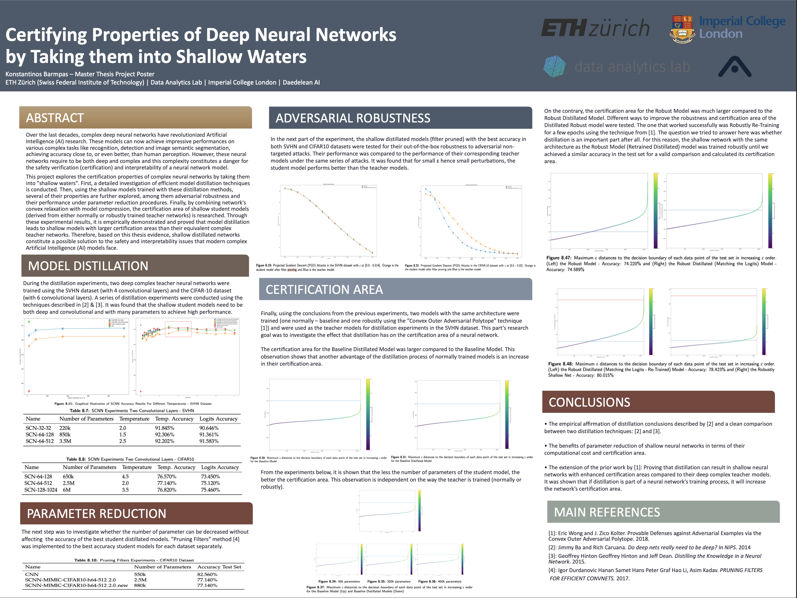
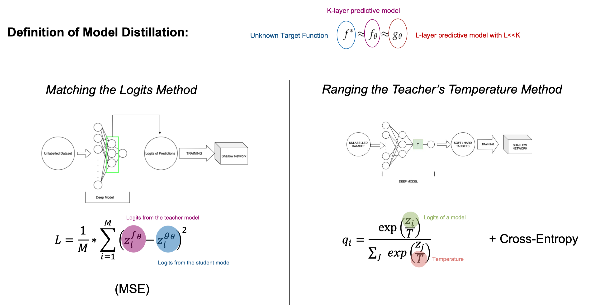
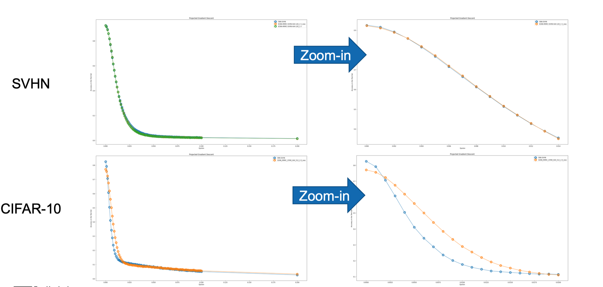
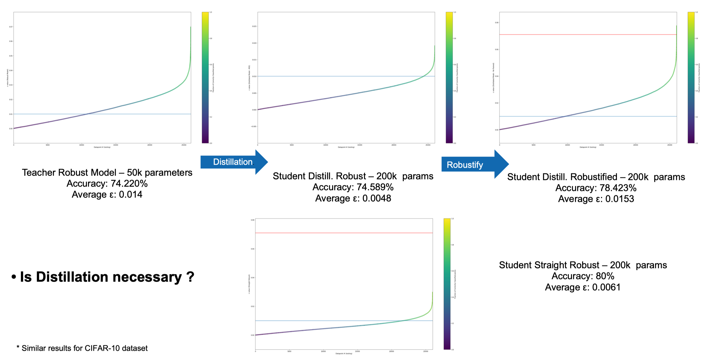

Master Thesis: <strong>Konstantinos Barmpas</strong> \
Supervisor: Professor Thomas Hofmann (ETH Zürich) \
Advisors: Yannic Kilcher (ETH Zürich), Kevin Roth (ETH Zürich), David Haber (Daedalean AI)

[Presentation Video]() [Repo](https://github.com/KonstantinosBarmpas/Shallow-Waters)

Over the last decades, complex deep neural networks have revolutionized Artificial Intelligence (AI) research. These models can now achieve impressive performances on various complex tasks like recognition, detection and image semantic segmentation, achieving accuracy close to, or even better, than human perception. However, these neural networks require to be both deep and complex and this complexity constitutes a danger for the safety verification (certification) and interpretability of a neural network model.

This project explores the certification properties of complex neural networks by taking them into ”shallow waters”. First, a detailed investigation of efficient model distillation techniques is conducted. Then, using the shallow models trained with these distillation methods, several of their properties are further explored, among them adversarial robustness and their performance under parameter reduction procedures. Finally, by combining network’s convex relaxation with model compression, the certification area of shallow student models (derived from either normally or robustly trained teacher networks) is researched. Through all of these experimental results, it is empirically demonstrated and proved that model distillation leads to shallow models with larger certification areas than their equivalent complex teacher networks. Therefore, based on this thesis evidence, shallow distillated networks constitute a possible solution to the safety and interpretability issues that modern complex Artificial Intelligence (AI) models face.

**Poster**

**Model Distillation**

Conclusions:

1)  In order to achieve a high classification accuracy score, the student model needs to be convolutional.

2) The student model needs to be deep: the more convolutional layers, the better the accuracy.

3) Large number of parameters is required to achieve high accuracy score.

3) The shallow student models trained via ”Ranging the Teacher’s Temperature” distillation technique achieve higher accuracy compared with their equivalent networks trained via ”Matching the Logits” distillation technique.

**Filter Pruning**

The method is based on the computation of L1-norm on the different filters. In each layer of the CNN, the sum of its absolute weights is calculated. When a filter is pruned, its feature map and its corresponding kernel in the next convolutional layer are also removed from the new network.

**Adversarial Robustness**

The shallow distillated models (filter pruned) with the best accuracy in both SVHN and CIFAR10 datasets are tested for their out-of-the-box robustness to adversarial non-targeted attacks.. In both datasets for small ε values hence small perturbations, the student model performs better under PGD attacks.

**Provable Robust Model - Distillation - Certification Area**

