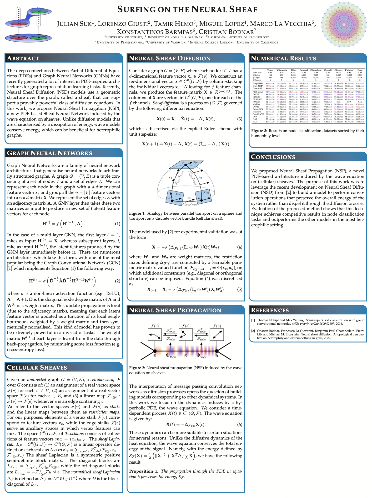

Authors: Julian Suk, Lorenzo Giusti, Tamir Hemo, Miguel Lopez, <strong>Konstantinos Barmpas</strong> and Cristian Bodnar

A group project carried out during the London Geometry and Machine Learning (LOGML) Summer School 2022 - [[Link](https://www.logml.ai/home-2022)] 

[[Workshop Page](https://www.neurreps.org)] 

The deep connections between Partial Differential Equations (PDEs) and Graph Neural Networks (GNNs) have recently generated a lot of interest in PDE-inspired architectures for learning on graphs. However, despite being more interpretable and better understood via well-established tools from PDE analysis, the dynamics these models use are often too simple for complicated node classification tasks. The recently proposed Neural Sheaf Diffusion (NSD) models address this by making use of an additional geometric structure over the graph, called a sheaf, that can support a provably powerful class of diffusion equations. In this work, we propose Neural Sheaf Propagation (NSP), a new PDE-based Sheaf Neural Network induced by the wave equation on sheaves. Unlike diffusion models that are characterised by a dissipation of energy, wave models conserve energy, which can be beneficial for node classification tasks on heterophilic graphs. In practice, we show that NSP obtains competitive results with NSD and outperforms many other existent models. 

**NeurIPS2022 NeurReps Poster**

