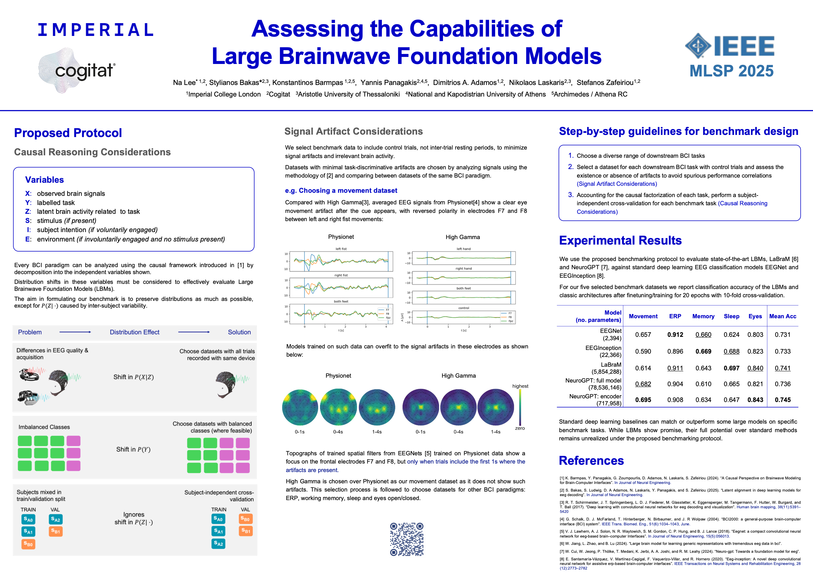

Authors: Na Lee\*, Stylianos Bakas\*, <strong>Konstantinos Barmpas</strong>, Yannis Panagakis, Dimitrios Adamos, Nikolaos Laskaris and Stefanos Zafeiriou

[[MLSP Page](https://ieeexplore.ieee.org/xpl/conhome/11204201/proceeding)] - [[Special Session](https://mlsp2025-decoding-brain.github.io)]

Over the last decade, deep learning models have been widely used for automatic feature extraction and classification in various Brain-Computer Interface (BCI) tasks. However, their performance and generalization capabilities are often not adequately assessed, as these models are frequently trained and tested under flawed setups and / or influenced by spurious correlations. Recently, these limitations have also been observed in the training and evaluation of Large Brainwave Foundation Models (LBMs). In this work, we employ causal reasoning and careful consideration for task-discriminative artifacts in various EEG datasets covering diverse BCI paradigms and propose a benchmarking protocol to properly evaluate the decoding performance and generalization capabilities of LBMs. Utilising a subject-independent cross-validation approach for each curated benchmark dataset, we showcase that LBMs achieve marginal performance gains over conventional deep learning baselines.

**MLSP Poster**

